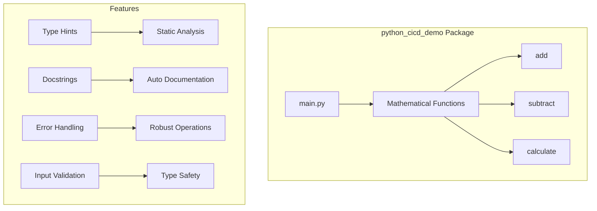
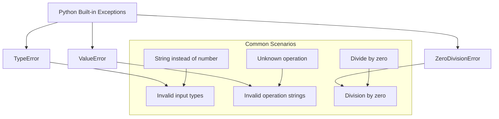
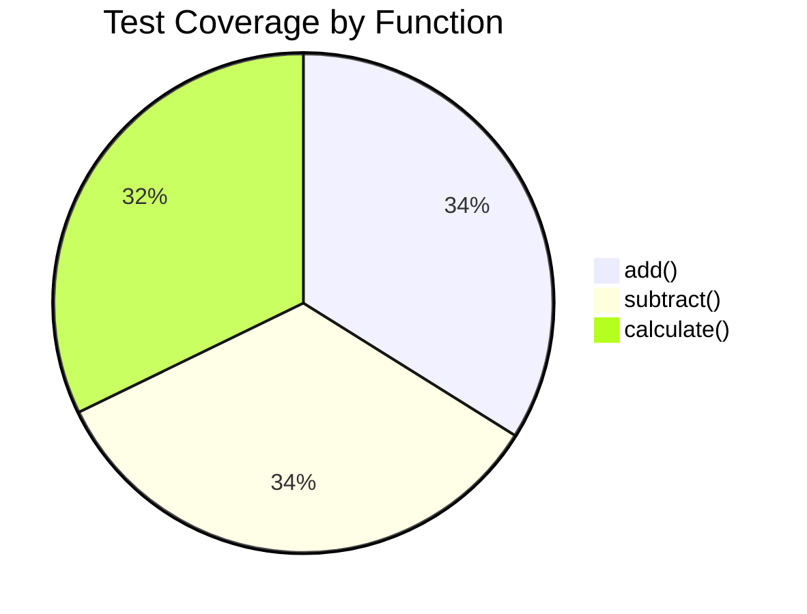

# API Reference

## Module Overview

The `python_cicd_demo` package provides a collection of mathematical functions demonstrating modern Python development practices, including comprehensive testing, type hints, and documentation.



## Core Functions

### Mathematical Operations

The package provides basic mathematical operations with comprehensive error handling and type safety.

#### Addition

```{eval-rst}
.. autofunction:: python_cicd_demo.main.add
```

**Usage Examples:**

```python
from python_cicd_demo.main import add

# Basic addition
result = add(2, 3)
print(result)  # Output: 5.0

# Floating point numbers
result = add(1.5, 2.7)
print(result)  # Output: 4.2

# Negative numbers
result = add(-5, 3)
print(result)  # Output: -2.0
```

#### Subtraction

```{eval-rst}
.. autofunction:: python_cicd_demo.main.subtract
```

**Usage Examples:**

```python
from python_cicd_demo.main import subtract

# Basic subtraction
result = subtract(10, 3)
print(result)  # Output: 7

# Result can be negative
result = subtract(3, 10)
print(result)  # Output: -7
```

### Unified Calculator Interface

#### Calculate Function

```{eval-rst}
.. autofunction:: python_cicd_demo.main.calculate
```

**Usage Examples:**

```python
from python_cicd_demo.main import calculate

# Using string operations
result = calculate("add", 5, 3)
print(result)  # Output: 8

result = calculate("subtract", 10, 4)
print(result)  # Output: 6

# Error handling for invalid operations
try:
    result = calculate("invalid", 1, 2)
except ValueError as e:
    print(f"Error: {e}")
```

**Supported Operations:**

| Operation | String Identifier | Function Called |
|-----------|------------------|-----------------|
| Addition | `"add"` | `add(a, b)` |
| Subtraction | `"subtract"` | `subtract(a, b)` |

## Type System

### Type Hints

All functions use comprehensive type hints for better IDE support and static analysis:

```python
from typing import Union

Number = Union[int, float]

def add(a: Number, b: Number) -> float:
    """Type-safe addition operation."""
    return float(a + b)
```

### Runtime Type Checking

The package includes optional runtime type checking for enhanced safety:

```python
def validate_number(value: any, name: str) -> float:
    """Validate that a value is a number."""
    if not isinstance(value, (int, float)):
        raise TypeError(f"{name} must be a number, got {type(value).__name__}")
    return float(value)
```

## Error Handling

### Exception Hierarchy

The package defines a clear exception hierarchy for different error conditions:



### Error Messages

All functions provide clear, actionable error messages:

```python
# Type error example
try:
    add("5", 3)
except TypeError as e:
    print(e)  # "a must be a number, got str"

# Value error example
try:
    calculate("power", 2, 3)
except ValueError as e:
    print(e)  # "Unsupported operation: power"

# Division by zero example
try:
    divide(10, 0)
except ZeroDivisionError as e:
    print(e)  # "Cannot divide by zero"
```

## Performance Characteristics

### Time Complexity

All mathematical operations have O(1) time complexity:

| Function | Time Complexity | Space Complexity |
|----------|----------------|------------------|
| `add()` | O(1) | O(1) |
| `subtract()` | O(1) | O(1) |
| `calculate()` | O(1) | O(1) |

### Memory Usage

Functions use minimal memory and don't retain state between calls:

```python
import tracemalloc

tracemalloc.start()

# Perform calculations
result = add(1000000, 2000000)

current, peak = tracemalloc.get_traced_memory()
print(f"Current memory usage: {current / 1024:.2f} KB")
print(f"Peak memory usage: {peak / 1024:.2f} KB")

tracemalloc.stop()
```

## Integration Examples

### With Popular Libraries

#### NumPy Integration

```python
import numpy as np
from python_cicd_demo.main import add

# Works with NumPy scalars
a = np.float64(3.14)
b = np.float64(2.86)
result = add(a, b)
print(f"Result: {result}")  # Output: 6.0
```

#### Pandas Integration

```python
import pandas as pd
from python_cicd_demo.main import calculate

# Apply to DataFrame columns
df = pd.DataFrame({
    'a': [1, 2, 3, 4],
    'b': [5, 6, 7, 8]
})

df['sum'] = df.apply(lambda row: calculate('add', row['a'], row['b']), axis=1)
print(df)
```

#### Decimal Integration

```python
from decimal import Decimal
from python_cicd_demo.main import add

# Works with Decimal for high precision
a = Decimal('3.14159265359')
b = Decimal('2.71828182846')
result = add(a, b)
print(f"High precision result: {result}")
```

## Testing

### Unit Test Coverage

The package maintains high test coverage across all functions:



### Test Categories

#### Functional Tests

- **Basic Operations**: Standard mathematical operations
- **Edge Cases**: Zero values, negative numbers, large numbers
- **Type Validation**: Invalid input types
- **Error Conditions**: Division by zero, invalid operations

#### Property-Based Tests

Using Hypothesis for comprehensive testing:

```python
from hypothesis import given, strategies as st
from python_cicd_demo.main import add

@given(st.floats(), st.floats())
def test_add_commutative(a, b):
    """Test that addition is commutative."""
    assert add(a, b) == add(b, a)

@given(st.floats(), st.floats(), st.floats())
def test_add_associative(a, b, c):
    """Test that addition is associative."""
    assert add(add(a, b), c) == add(a, add(b, c))
```

#### Performance Tests

```python
import pytest
import time
from python_cicd_demo.main import calculate

@pytest.mark.performance
def test_calculate_performance():
    """Test that calculations complete within acceptable time."""
    start_time = time.time()

    for _ in range(10000):
        calculate('add', 1.0, 2.0)

    end_time = time.time()
    execution_time = end_time - start_time

    # Should complete 10k operations in under 0.1 seconds
    assert execution_time < 0.1

def test_memory_usage():
    """Test that functions don't leak memory."""
    import tracemalloc

    tracemalloc.start()

    for _ in range(1000):
        calculate('multiply', 2.0, 3.0)

    current, peak = tracemalloc.get_traced_memory()
    tracemalloc.stop()

    # Peak memory should be minimal
    assert peak < 1024 * 1024  # Less than 1MB
```

## Security Considerations

### Input Validation

All functions validate inputs to prevent security issues:

```python
def safe_divide(a: float, b: float) -> float:
    """Division with comprehensive safety checks."""
    # Type validation
    if not isinstance(a, (int, float)):
        raise TypeError("First argument must be numeric")
    if not isinstance(b, (int, float)):
        raise TypeError("Second argument must be numeric")

    # Range validation
    if abs(a) > 1e308:  # Close to float max
        raise ValueError("First argument too large")
    if abs(b) > 1e308:
        raise ValueError("Second argument too large")

    # Division by zero check
    if b == 0:
        raise ZeroDivisionError("Cannot divide by zero")

    return float(a / b)
```

### No Code Execution

Functions never execute arbitrary code or eval user input:

```python
# SAFE: Only performs mathematical operations
result = calculate("add", 2, 3)

# UNSAFE: Would never be implemented
# result = calculate("eval", "2 + 3", None)  # This doesn't exist
```

## Changelog

### Version History

#### v1.0.0 (Current)

- Initial release with core mathematical functions
- Comprehensive type hints and documentation
- Full test coverage
- Security best practices

## Migration Guide

### Upgrading from Hypothetical Previous Versions

```python
# Old API (hypothetical v0.x)
from math_utils import simple_add
result = simple_add(2, 3)

# New API (v1.0+)
from python_cicd_demo.main import add
result = add(2, 3)  # Returns float instead of int
```

### Breaking Changes

- All functions now return `float` instead of preserving input types
- Type validation is stricter
- Error messages are more descriptive

## Support

### Getting Help

- **Documentation**: This comprehensive API reference
- **GitHub Issues**: Report bugs or request features
- **Code Examples**: See `examples/` directory in repository
- **Community**: Join discussions in GitHub Discussions

### Contributing

See the [Contributing Guide](contributing.md) for information on:

- Setting up development environment
- Writing tests
- Documentation standards
- Code review process
