# CI/CD Pipeline Documentation

## Pipeline Overview

Our CI/CD pipeline is built on GitHub Actions and consists of four main workflows that ensure code quality, security, and reliable deployments. Each workflow serves a specific purpose and can be triggered by different events.


### Performance Optimization

1. **Efficient Caching**: Strategic use of build caches
2. **Resource Allocation**: Right-sized compute resources
3. **Concurrent Execution**: Parallel job execution where possible
4. **Incremental Builds**: Only build what has changed
5. **Monitoring**: Continuous performance monitoring and optimization

## Summary

Our CI/CD pipeline implementation provides a comprehensive framework for modern Python development with:

**Automated Quality Gates:**

- **Semantic Versioning**: Automatic version calculation based on commit messages
- **Security Scanning**: Multi-layered vulnerability detection and prevention
- **Code Quality**: Consistent formatting and type safety enforcement
- **Documentation**: Automated building and deployment to GitHub Pages
- **Testing**: Comprehensive test coverage across multiple Python versions

The combination of pre-commit hooks, GitHub Actions workflows, and development best practices creates a robust foundation for professional software development that ensures code quality, security, and maintainability throughout the development lifecycle.


## Workflow Details

### 1. Continuous Integration (ci.yml)

The CI workflow is the backbone of our quality assurance process, running on every push and pull request to main/develop branches.

#### Triggers

- **Push**: To `main` and `develop` branches
- **Pull Request**: Targeting `main` branch
- **Manual**: Via `workflow_dispatch`

#### Permissions

- `contents: read` - Access repository content
- `checks: write` - Update check status
- `pull-requests: write` - Comment on PRs

#### Jobs Structure

```mermaid
flowchart TD
    A[Trigger: Push/PR] --> B[Checkout Code]
    B --> C[Setup Python Matrix]
    C --> D[Install Poetry]
    D --> E[Install Dependencies]
    E --> F[Cache Dependencies]

    F --> G[Lint & Security Job]
    G --> H[Run Black]
    G --> I[Run isort]
    G --> J[Run Bandit]

    H --> K{Format Check}
    I --> L{Import Check}
    J --> M{Security Check}

    K --> N[Test Job]
    L --> N
    M --> N

    N --> O[Multi-Python Testing]
    O --> P[Generate Coverage]
    P --> Q[Upload to Codecov]
    Q --> R[Create Artifacts]

    R --> S{All Checks Pass?}
    S -->|Yes| T[✅ Success]
    S -->|No| U[❌ Failure]
```



#### Job 1: lint-and-security

This job runs code quality and security checks using Python 3.11:

**Steps:**

1. **Checkout code** - Shallow clone with `fetch-depth: 1`
2. **Set up Python 3.11** - Base Python version for consistency
3. **Install Poetry** - Latest version with in-project venv
4. **Cache dependencies** - Poetry cache keyed by `poetry.lock`
5. **Install dev dependencies** - Only development dependencies needed
6. **Run Black** - Code formatting validation (`--check` mode)
7. **Run isort** - Import sorting validation (`--check-only` mode)
8. **Run Bandit** - Security vulnerability scanning (`-r src/`)

#### Job 2: test

This job runs comprehensive tests across multiple Python versions (3.11, 3.12):

**Matrix Strategy:**

- `fail-fast: false` - Continue testing other versions if one fails
- `python-version: ['3.11', '3.12']` - Multi-version compatibility

**Steps:**

1. **Checkout code** - Fresh shallow clone
2. **Set up Python** - Matrix-specific Python version
3. **Install Poetry** - Consistent tooling across versions
4. **Cache dependencies** - Version-specific cache keys
5. **Install all dependencies** - Full project dependencies
6. **Run tests with coverage** - pytest with XML and terminal reports
7. **Upload to Codecov** - Coverage analysis and trends
8. **Upload test artifacts** - Results archived for 30 days

**Coverage Configuration:**

- Target: `src/python_cicd_demo` module
- Reports: XML (Codecov), terminal (CI logs)
- Failure tolerance: `fail_ci_if_error: false`

### 2. Security Analysis (security.yml)

Comprehensive security scanning workflow with multiple analysis types.

#### Security Triggers

- **Push**: To `main` and `develop` branches
- **Pull Request**: Targeting `main` branch
- **Schedule**: Weekly on Mondays at 6 AM UTC (`0 6 * * 1`)

#### Security Permissions

- `contents: read` - Repository access
- `security-events: write` - SARIF upload to Security tab
- `actions: read` - Workflow metadata access

#### Security Jobs Structure

```mermaid
flowchart TD
    A[Trigger: Push/PR/Schedule] --> B[CodeQL Job]
    A --> C[Dependency Review Job]

    B --> D[Checkout Repository]
    D --> E[Initialize CodeQL]
    E --> F[Set Language: Python]
    F --> G[Security-Extended Queries]
    G --> H[Autobuild Project]
    H --> I[Perform Analysis]
    I --> J[Upload SARIF Results]

    C --> K{Is Pull Request?}
    K -->|Yes| L[Checkout Repository]
    L --> M[Run Dependency Review]
    M --> N[Check for Vulnerabilities]
    N --> O{Moderate+ Severity?}
    O -->|Yes| P[❌ Fail CI]
    O -->|No| Q[✅ Pass]
    K -->|No| R[Skip Job]
```



#### Job 1: codeql

Advanced semantic code analysis to identify security vulnerabilities:

**Configuration:**

- **Matrix**: `language: ['python']` - Extensible for multiple languages
- **Queries**: `security-extended` - Enhanced security-focused analysis
- **Fail-fast**: `false` - Complete analysis even if issues found

**Steps:**

1. **Checkout repository** - Full repository access for analysis
2. **Initialize CodeQL** - Set up analysis environment
3. **Autobuild** - Automatic project build detection
4. **Perform analysis** - Deep semantic code scanning
5. **Upload results** - SARIF format to GitHub Security tab

**Analysis Coverage:**

- SQL injection vulnerabilities
- Cross-site scripting (XSS) patterns
- Path traversal vulnerabilities
- Command injection risks
- Cryptographic weaknesses
- Authentication bypasses

#### Job 2: dependency-review

Automated dependency vulnerability scanning for pull requests:

**Conditions:**

- **Trigger**: Only on `pull_request` events
- **Failure threshold**: `moderate` severity or higher

**Steps:**

1. **Checkout repository** - Access to dependency files
2. **Dependency review** - Compare base vs. head dependencies
3. **Vulnerability analysis** - Check against known CVE database
4. **License compliance** - Validate license compatibility

**Checks Performed:**

- New vulnerable dependencies introduced
- License policy violations
- Dependency version downgrades
- Supply chain risk assessment

### 3. Release Pipeline (release.yml)

Automated release management with semantic versioning and package publishing.

#### Release Triggers

- **Push**: To `main` branch only
- **Conditional**: Skipped if commit message contains `skip-release`

#### Release Permissions

- `contents: write` - Create releases and tags
- `packages: write` - Publish to GitHub Packages
- `pull-requests: write` - Update related PRs

#### Job: release

Comprehensive release automation with semantic versioning:

**Conditions:**

- **Branch**: Must be `main` branch
- **Commit message**: Must not contain `skip-release`

**Steps:**

1. **Checkout code** - Full history with `fetch-depth: 0`
2. **Set up Python 3.8** - Consistent release environment
3. **Install Poetry** - Package management and building
4. **Cache dependencies** - Release-specific cache key
5. **Install dependencies** - Full project dependencies
6. **Configure Git** - Bot user for automated commits
7. **Run semantic release** - Version calculation and tagging
8. **Build package** - Create distribution artifacts
9. **Upload artifacts** - Archive for 90 days

**Semantic Release Process:**

- **Analyze commits** - Parse conventional commit messages
- **Calculate version** - Determine major/minor/patch bump
- **Generate changelog** - Automated release notes
- **Create GitHub release** - Tagged release with assets
- **Publish package** - Upload to configured registries

**Version Calculation Rules:**

- `feat:` → Minor version bump (0.1.0 → 0.2.0)
- `fix:` → Patch version bump (0.1.0 → 0.1.1)
- `BREAKING CHANGE:` → Major version bump (0.1.0 → 1.0.0)
- Other types → No version bump

### 4. Documentation (docs.yml)

Automated documentation building and deployment to GitHub Pages.

#### Documentation Triggers

- **Push**: To `main` branch
- **Path filters**: Only when docs/, src/, or README.md change
- **Manual**: Via `workflow_dispatch`

#### Documentation Permissions

- `contents: read` - Repository access
- `pages: write` - Deploy to GitHub Pages
- `id-token: write` - OIDC authentication

#### Concurrency

- **Group**: `pages` - Only one Pages deployment at a time
- **Cancel in progress**: `false` - Allow completion of running deployments

#### Documentation Jobs Structure


#### Job 1: build-docs

Documentation compilation and preparation:

**Steps:**

1. **Checkout code** - Shallow clone for efficiency
2. **Set up Python 3.8** - Consistent build environment
3. **Install Poetry** - Dependency management
4. **Cache dependencies** - Docs-specific cache key
5. **Install dependencies** - Full project dependencies
6. **Build documentation** - Sphinx HTML generation
7. **Upload artifact** - Pages-compatible artifact

**Build Configuration:**

- **Source**: `docs/source/` directory
- **Output**: `docs/_build/html/` directory
- **Format**: HTML with Read the Docs theme
- **Extensions**: MyST parser, autodoc, Napoleon

#### Job 2: deploy-docs

GitHub Pages deployment with environment protection:

**Environment:**

- **Name**: `github-pages` - Protected environment
- **URL**: Dynamic from deployment output

**Steps:**

1. **Deploy to Pages** - Uses uploaded artifact
2. **Set output URL** - Available for other workflows

**Deployment Features:**

- **Custom domain support** - Configurable via repository settings
- **HTTPS enforcement** - Automatic SSL certificate
- **CDN acceleration** - Global content delivery
- **Branch protection** - Only main branch deployments

## Pre-commit Hooks Configuration

Our pre-commit configuration provides comprehensive code quality and security checks before commits are allowed. This creates a robust development workflow that prevents common issues from entering the repository.

### Pre-commit Setup

```yaml
repos:
  - repo: https://github.com/pre-commit/pre-commit-hooks
    rev: v4.4.0
    hooks:
      - id: trailing-whitespace
      - id: end-of-file-fixer
      - id: check-yaml
      - id: check-added-large-files
      - id: check-json
      - id: check-toml
      - id: check-merge-conflict
      - id: debug-statements

  - repo: https://github.com/psf/black
    rev: 23.3.0
    hooks:
      - id: black

  - repo: https://github.com/pycqa/isort
    rev: 5.12.0
    hooks:
      - id: isort

  - repo: https://github.com/pycqa/bandit
    rev: 1.7.5
    hooks:
      - id: bandit
        args: ['-r', 'src/']

  - repo: https://github.com/pre-commit/mirrors-mypy
    rev: v1.3.0
    hooks:
      - id: mypy
        additional_dependencies: [types-all]
```

### Hook Categories

#### File Quality Hooks (pre-commit-hooks)

##### trailing-whitespace

- **Purpose**: Removes trailing whitespace from lines
- **Benefits**: Prevents unnecessary diff noise and formatting inconsistencies
- **Files**: All text files

##### end-of-file-fixer

- **Purpose**: Ensures files end with a single newline character
- **Benefits**: Complies with POSIX standards and prevents merge conflicts
- **Files**: All text files

##### check-yaml

- **Purpose**: Validates YAML file syntax
- **Benefits**: Prevents workflow failures due to malformed YAML
- **Files**: `.yml`, `.yaml` files (GitHub Actions, configs)

##### check-added-large-files

- **Purpose**: Prevents committing files larger than 500KB by default
- **Benefits**: Keeps repository size manageable and prevents accidental binary commits
- **Configuration**: Configurable size limit

##### check-json

- **Purpose**: Validates JSON file syntax
- **Benefits**: Ensures configuration files are properly formatted
- **Files**: `.json` files (package configs, settings)

##### check-toml

- **Purpose**: Validates TOML file syntax
- **Benefits**: Ensures Poetry and tool configurations are valid
- **Files**: `pyproject.toml`, other TOML configs

##### check-merge-conflict

- **Purpose**: Detects merge conflict markers
- **Benefits**: Prevents committing unresolved conflicts
- **Pattern**: `<<<<<<< ======= >>>>>>>` markers

##### debug-statements

- **Purpose**: Detects Python debug statements
- **Benefits**: Prevents debugging code from reaching production
- **Patterns**: `pdb.set_trace()`, `breakpoint()`, `print()` (configurable)

#### 2. Code Formatting Hooks

##### black

- **Purpose**: Python code formatting with opinionated style
- **Benefits**: Consistent code style, eliminates formatting debates
- **Configuration**: PEP 8 compliant with 88-character line length
- **Files**: `.py` files

##### isort

- **Purpose**: Import statement sorting and organization
- **Benefits**: Consistent import organization, reduces merge conflicts
- **Configuration**: Compatible with Black formatting
- **Sections**: Standard library, third-party, local imports

#### 3. Security and Quality Hooks

##### bandit

- **Purpose**: Security vulnerability scanning for Python code
- **Benefits**: Identifies common security issues before commit
- **Coverage**:
  - Hardcoded passwords and secrets
  - SQL injection vulnerabilities
  - Shell injection risks
  - Cryptographic weaknesses
  - Unsafe function usage

##### mypy

- **Purpose**: Static type checking for Python
- **Benefits**: Catches type-related errors before runtime
- **Configuration**: Strict type checking with additional type stubs
- **Coverage**: Function signatures, variable types, return types

### Integration with CI/CD

The pre-commit hooks work in conjunction with our CI/CD pipeline:

#### Local Development Flow


#### Quality Gate Integration

- **Local**: Pre-commit hooks catch issues before commit
- **CI**: Workflows verify the same checks in CI environment
- **Redundancy**: Multiple layers ensure quality and security
- **Feedback**: Immediate local feedback vs. delayed CI feedback

### Installation and Usage

#### Setup Commands

```bash
# Install pre-commit
pip install pre-commit

# Install hooks
pre-commit install

# Run on all files (optional)
pre-commit run --all-files

# Update hook versions
pre-commit autoupdate
```

#### Bypass Options (Use Sparingly)

```bash
# Skip all hooks (emergency only)
git commit --no-verify

# Skip specific hook
SKIP=bandit git commit -m "commit message"
```

## Workflow Integration and Dependencies

Our CI/CD pipeline is designed with clear dependencies and integration points that create a comprehensive development and deployment workflow.

### Workflow Orchestration


### Pipeline Dependencies

#### Branch Protection Requirements

- **CI Pipeline**: Must pass on all PRs
- **Security Pipeline**: Must pass on all PRs
- **Dependency Review**: Must pass on PRs with dependency changes
- **Manual Review**: Required for production deployments

#### Artifact Flow

1. **CI Pipeline** → Test results and coverage reports
2. **Release Pipeline** → Built packages and distribution files
3. **Documentation Pipeline** → Static site artifacts
4. **Security Pipeline** → SARIF reports and security advisories

### Key Integration Points

#### Quality Gates

- **Pre-commit**: Local quality enforcement
- **CI Tests**: Comprehensive validation in clean environment
- **Security Scans**: Vulnerability and dependency analysis
- **Manual Reviews**: Human oversight for critical changes

#### Deployment Flow

- **Development**: Continuous testing and validation
- **Staging**: Documentation deployment for review
- **Production**: Release deployment with semantic versioning

#### Monitoring and Feedback

- **Real-time**: Pre-commit hook feedback during development
- **Batch**: CI pipeline results on push/PR
- **Scheduled**: Security scans and dependency updates
- **Release**: Automated release notes and changelog generation

## Best Practices and Recommendations

### Development Workflow

1. **Local Development**: Use pre-commit hooks for immediate feedback
2. **Feature Branches**: Create focused branches for specific features
3. **Conventional Commits**: Use semantic commit messages for automated releases
4. **Testing**: Write tests before implementation (TDD approach)
5. **Documentation**: Update docs alongside code changes

### Security Practices

1. **Dependency Management**: Regular security updates via automated scanning
2. **Secret Management**: Never commit secrets; use environment variables
3. **Access Control**: Limit permissions to minimum required scope
4. **Monitoring**: Continuous monitoring of security advisories and CVEs
5. **Response Plan**: Clear procedures for security incident response

### Pipeline Summary

Our CI/CD pipeline implementation provides a comprehensive framework for modern Python development with:

**Automated Quality Gates:**

- **Semantic Versioning**: Automatic version calculation based on commit messages
- **Security Scanning**: Multi-layered vulnerability detection and prevention
- **Code Quality**: Consistent formatting and type safety enforcement
- **Documentation**: Automated building and deployment to GitHub Pages
- **Testing**: Comprehensive test coverage across multiple Python versions

The combination of pre-commit hooks, GitHub Actions workflows, and development best practices creates a robust foundation for professional software development that ensures code quality, security, and maintainability throughout the development lifecycle.



```mermaid
flowchart TD
    A[Trigger: Tag Push] --> B[Checkout Code]
    B --> C[Setup Node.js]
    C --> D[Install Semantic Release]
    D --> E[Analyze Commits]

    E --> F{Version Bump Needed?}
    F -->|No| G[Skip Release]
    F -->|Yes| H[Calculate New Version]

    H --> I[Generate Changelog]
    I --> J[Create Git Tag]
    J --> K[Create GitHub Release]
    K --> L[Build Docker Image]

    L --> M[Security Scan Image]
    M --> N{Image Secure?}
    N -->|No| O[❌ Block Release]
    N -->|Yes| P[Tag Image]

    P --> Q[Push to Registry]
    Q --> R[Update Documentation]
    R --> S[Notify Stakeholders]

    S --> T[✅ Release Complete]
    O --> U[🚨 Security Alert]
```

**Release Features:**

- **Semantic Versioning**: Automatic version calculation based on commit messages
- **Changelog Generation**: Automated release notes from conventional commits
- **Docker Integration**: Containerized releases with security scanning
- **Multi-stage Deployment**: Staged rollout with rollback capabilities

### Documentation Workflow Details

Automated documentation building and deployment to GitHub Pages.



```mermaid
flowchart TD
    A[Trigger: Push to Main] --> B[Checkout Code]
    B --> C[Setup Python]
    C --> D[Install Dependencies]
    D --> E[Install Sphinx Extensions]

    E --> F[Build API Documentation]
    F --> G[Generate Sphinx HTML]
    G --> H[Process Mermaid Diagrams]
    H --> I[Optimize Assets]

    I --> J{Build Successful?}
    J -->|No| K[❌ Build Failed]
    J -->|Yes| L[Deploy to GitHub Pages]

    L --> M[Update DNS Records]
    M --> N[Invalidate CDN Cache]
    N --> O[Verify Deployment]

    O --> P{Site Accessible?}
    P -->|No| Q[🚨 Deployment Alert]
    P -->|Yes| R[✅ Docs Updated]

    K --> S[Generate Build Report]
    Q --> T[Rollback to Previous]
```

## Pipeline Configuration

### Environment Variables

```yaml
# Required for all workflows
GITHUB_TOKEN: ${{ secrets.GITHUB_TOKEN }}
CODECOV_TOKEN: ${{ secrets.CODECOV_TOKEN }}

# Release workflow specific
NPM_TOKEN: ${{ secrets.NPM_TOKEN }}
DOCKER_REGISTRY: ghcr.io
DOCKER_USERNAME: ${{ github.actor }}
DOCKER_PASSWORD: ${{ secrets.GITHUB_TOKEN }}

# Documentation workflow specific
PAGES_BRANCH: gh-pages
DOCS_DIRECTORY: docs/_build/html
```

### Matrix Strategy

Our CI pipeline uses matrix builds to ensure compatibility across multiple Python versions:

```yaml
strategy:
  matrix:
    python-version: ["3.8", "3.9", "3.10", "3.11", "3.12"]
    os: [ubuntu-latest, windows-latest, macos-latest]
    exclude:
      - os: windows-latest
        python-version: "3.8"  # Skip older Python on Windows
```

### Caching Strategy

Efficient caching reduces build times and improves developer experience:


## Monitoring and Observability

### Pipeline Metrics

We track several key metrics to ensure pipeline health:

- **Build Success Rate**: Percentage of successful pipeline runs
- **Build Duration**: Time from trigger to completion
- **Test Coverage**: Code coverage percentage trends
- **Security Findings**: Number and severity of security issues
- **Deployment Frequency**: Rate of successful deployments

### Alerting Strategy


### Dashboard Integration

Pipeline status and metrics are integrated with:

- **GitHub Actions Dashboard**: Native GitHub interface
- **Third-party Monitoring**: Integration with external monitoring tools
- **Custom Dashboards**: Project-specific metrics visualization
- **Mobile Notifications**: Critical alerts via mobile apps

## Best Practices

### Workflow Design Principles

1. **Fail Fast**: Catch issues early in the pipeline
2. **Parallel Execution**: Run independent jobs concurrently
3. **Idempotent Operations**: Ensure workflows can be safely re-run
4. **Clear Feedback**: Provide actionable error messages
5. **Resource Efficiency**: Optimize for speed and cost

### Security Considerations

1. **Least Privilege**: Use minimal required permissions
2. **Secret Management**: Secure handling of sensitive data
3. **Audit Trail**: Complete logging of all pipeline activities
4. **Compliance**: Adherence to security standards and regulations
5. **Regular Updates**: Keep all tools and dependencies current

### Performance Best Practices

1. **Efficient Caching**: Strategic use of build caches
2. **Resource Allocation**: Right-sized compute resources
3. **Concurrent Execution**: Parallel job execution where possible
4. **Incremental Builds**: Only build what has changed
5. **Monitoring**: Continuous performance monitoring and optimization
