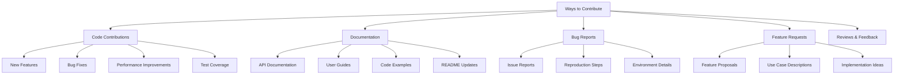
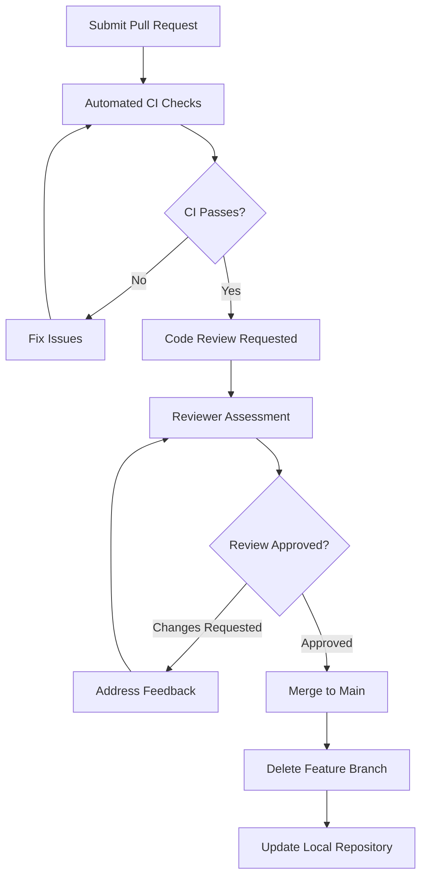

# Contributing to Python CI/CD Demo

We welcome contributions to this project! This guide will help you understand how to contribute effectively while maintaining the high quality standards we've established.

## Code of Conduct

This project adheres to a code of conduct that we expect all contributors to follow. Please be respectful, inclusive, and professional in all interactions.

### Our Standards

- **Be Respectful**: Treat everyone with respect and kindness
- **Be Inclusive**: Welcome people of all backgrounds and experience levels
- **Be Collaborative**: Work together constructively and help others learn
- **Be Professional**: Maintain professional communication in all contexts

## How to Contribute

### Types of Contributions

We welcome several types of contributions:



### Getting Started

#### 1. Fork and Clone

```bash
# Fork the repository on GitHub
# Then clone your fork locally
git clone https://github.com/yourusername/python-cicd-demo.git
cd python-cicd-demo

# Add the original repository as upstream
git remote add upstream https://github.com/originalowner/python-cicd-demo.git
```

#### 2. Set Up Development Environment

```bash
# Install dependencies
poetry install

# Install pre-commit hooks
poetry run pre-commit install

# Verify setup
poetry run pytest
make lint
```

#### 3. Create a Feature Branch

```bash
# Create and switch to a new branch
git checkout -b feature/your-feature-name

# Keep your branch up to date
git fetch upstream
git rebase upstream/main
```

## Development Workflow

### Making Changes

#### 1. Understand the Codebase

Before making changes, familiarize yourself with:

- Project structure and organization
- Existing test patterns and conventions
- Code style and formatting rules
- Documentation standards

#### 2. Follow Development Standards

**Code Quality Checklist:**

- [ ] Code follows PEP 8 style guidelines
- [ ] All functions have docstrings
- [ ] Type hints are provided where appropriate
- [ ] Tests are written for new functionality
- [ ] Security considerations are addressed
- [ ] Performance impact is considered

**Testing Requirements:**

- [ ] Unit tests for all new functions
- [ ] Integration tests for new features
- [ ] Edge cases and error conditions tested
- [ ] Test coverage remains above 80%
- [ ] All tests pass locally

#### 3. Writing Quality Code

**Function Documentation Example:**

```python
def process_data(data: List[Dict[str, Any]], validate: bool = True) -> ProcessedData:
    """Process raw data and return structured results.

    This function takes raw input data, validates it according to the schema,
    and transforms it into a structured format suitable for further processing.

    Args:
        data: List of dictionaries containing raw data records
        validate: Whether to perform schema validation (default: True)

    Returns:
        ProcessedData object containing validated and transformed data

    Raises:
        ValidationError: If data doesn't match expected schema
        ProcessingError: If transformation fails

    Example:
        >>> raw_data = [{"id": 1, "value": "test"}]
        >>> result = process_data(raw_data)
        >>> print(result.count)
        1

    Note:
        This function may be slow for large datasets. Consider using
        process_data_async() for datasets larger than 10,000 records.
    """
    # Implementation here
```

**Test Pattern Example:**

```python
class TestProcessData:
    """Test suite for process_data function."""

    @pytest.fixture
    def sample_data(self):
        """Provide sample data for testing."""
        return [
            {"id": 1, "value": "test1"},
            {"id": 2, "value": "test2"},
        ]

    def test_process_data_success(self, sample_data):
        """Test successful data processing."""
        result = process_data(sample_data)

        assert result.count == 2
        assert all(record.validated for record in result.records)

    def test_process_data_validation_disabled(self, sample_data):
        """Test processing with validation disabled."""
        result = process_data(sample_data, validate=False)

        assert result.count == 2
        # Validation flags should be False
        assert not any(record.validated for record in result.records)

    @pytest.mark.parametrize("invalid_data,expected_error", [
        ([], ProcessingError),
        ([{"invalid": "structure"}], ValidationError),
        (None, TypeError),
    ])
    def test_process_data_error_cases(self, invalid_data, expected_error):
        """Test error handling for invalid inputs."""
        with pytest.raises(expected_error):
            process_data(invalid_data)
```

### Commit Guidelines

#### Commit Message Format

We follow the [Conventional Commits](https://www.conventionalcommits.org/) specification:

```
<type>[optional scope]: <description>

[optional body]

[optional footer(s)]
```

**Commit Types:**

- `feat`: New feature
- `fix`: Bug fix
- `docs`: Documentation only changes
- `style`: Changes that don't affect meaning (formatting, etc.)
- `refactor`: Code change that neither fixes a bug nor adds a feature
- `perf`: Performance improvement
- `test`: Adding missing tests or correcting existing tests
- `chore`: Changes to build process or auxiliary tools

**Examples:**

```bash
# Simple feature
git commit -m "feat: add user authentication system"

# Bug fix with scope
git commit -m "fix(api): resolve timeout issue in user login"

# Breaking change
git commit -m "feat!: change API response format

BREAKING CHANGE: API responses now use camelCase instead of snake_case"

# Multiple changes
git commit -m "feat: add data validation

- Add schema validation for user input
- Implement error handling for invalid data
- Add comprehensive tests for edge cases

Closes #123"
```

### Pull Request Process

#### 1. Pre-submission Checklist

Before submitting a pull request:

- [ ] Code is properly formatted (`make format`)
- [ ] All linting checks pass (`make lint`)
- [ ] All tests pass (`make test`)
- [ ] Security scan passes (`make security-scan`)
- [ ] Documentation is updated if needed
- [ ] Commit messages follow convention
- [ ] Branch is up to date with main

#### 2. Pull Request Template

When creating a pull request, use this template:

```markdown
## Description

Brief description of the changes made.

## Type of Change

- [ ] Bug fix (non-breaking change which fixes an issue)
- [ ] New feature (non-breaking change which adds functionality)
- [ ] Breaking change (fix or feature that would cause existing functionality to not work as expected)
- [ ] Documentation update

## How Has This Been Tested?

Describe the tests that you ran to verify your changes:

- [ ] Unit tests
- [ ] Integration tests
- [ ] Manual testing
- [ ] Performance testing

## Screenshots (if applicable)

Include screenshots or recordings of UI changes.

## Checklist

- [ ] My code follows the style guidelines of this project
- [ ] I have performed a self-review of my own code
- [ ] I have commented my code, particularly in hard-to-understand areas
- [ ] I have made corresponding changes to the documentation
- [ ] My changes generate no new warnings
- [ ] I have added tests that prove my fix is effective or that my feature works
- [ ] New and existing unit tests pass locally with my changes
- [ ] Any dependent changes have been merged and published

## Related Issues

Closes #[issue number]
```

#### 3. Review Process



**Review Criteria:**

- **Functionality**: Does the code work as intended?
- **Code Quality**: Is the code clean, readable, and maintainable?
- **Testing**: Are there adequate tests with good coverage?
- **Documentation**: Is the code properly documented?
- **Security**: Are there any security vulnerabilities?
- **Performance**: Does the change impact performance?

## Reporting Issues

### Bug Reports

When reporting bugs, please include:

#### Required Information

1. **Clear Description**: What happened vs. what you expected
2. **Reproduction Steps**: Detailed steps to reproduce the issue
3. **Environment Details**: OS, Python version, dependency versions
4. **Error Messages**: Full error messages and stack traces
5. **Code Examples**: Minimal code that demonstrates the issue

#### Bug Report Template

```markdown
## Bug Description

A clear and concise description of what the bug is.

## To Reproduce

Steps to reproduce the behavior:
1. Go to '...'
2. Click on '....'
3. Scroll down to '....'
4. See error

## Expected Behavior

A clear and concise description of what you expected to happen.

## Screenshots

If applicable, add screenshots to help explain your problem.

## Environment

- OS: [e.g. Ubuntu 22.04, macOS 13.0, Windows 11]
- Python Version: [e.g. 3.11.2]
- Poetry Version: [e.g. 1.4.2]
- Package Version: [e.g. 1.2.3]

## Additional Context

Add any other context about the problem here.

## Error Output

```
Paste full error messages and stack traces here
```

```

### Feature Requests

For feature requests, please provide:

#### Required Information

1. **Problem Statement**: What problem does this solve?
2. **Proposed Solution**: How should it work?
3. **Use Cases**: When would this be useful?
4. **Implementation Ideas**: Any thoughts on implementation?
5. **Breaking Changes**: Would this require breaking changes?

#### Feature Request Template

```markdown
## Problem Statement

A clear and concise description of what the problem is.

## Proposed Solution

A clear and concise description of what you want to happen.

## Use Cases

Describe specific scenarios where this feature would be helpful:

1. **Use Case 1**: Description of scenario
2. **Use Case 2**: Description of scenario

## Alternatives Considered

A clear and concise description of any alternative solutions or features you've considered.

## Implementation Notes

Any ideas about how this might be implemented:

- API design considerations
- Backward compatibility concerns
- Performance implications
- Security considerations

## Additional Context

Add any other context or screenshots about the feature request here.
```

## Community Guidelines

### Communication Channels

- **GitHub Issues**: Bug reports and feature requests
- **GitHub Discussions**: Questions, ideas, and general discussion
- **Pull Requests**: Code contributions and reviews
- **Documentation**: Guides, tutorials, and API reference

### Getting Help

If you need help:

1. **Check Documentation**: Look through existing documentation
2. **Search Issues**: See if someone else has asked the same question
3. **Ask in Discussions**: Use GitHub Discussions for questions
4. **Be Specific**: Provide context and details when asking for help

### Helping Others

You can help the community by:

- **Answering Questions**: Help others in discussions and issues
- **Reviewing Pull Requests**: Provide constructive feedback
- **Improving Documentation**: Fix typos, add examples, clarify instructions
- **Sharing Experience**: Write about your use cases and solutions

## Recognition

We appreciate all contributions and will acknowledge contributors in:

- **Release Notes**: Major contributors mentioned in release announcements
- **Contributors Page**: All contributors listed in documentation
- **Special Recognition**: Outstanding contributions highlighted in README

Thank you for contributing to making this project better for everyone!
