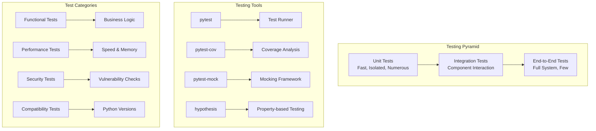
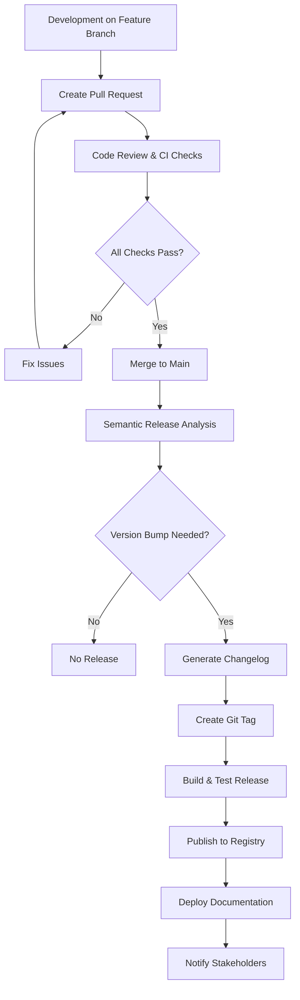

# Development Guide

## Development Environment Setup

### IDE Configuration

While you can use any editor for this project, we recommend VS Code with the following configuration for the best development experience.

#### Recommended VS Code Extensions

The project includes an `.vscode/extensions.json` file with recommended extensions:

```json
{
  "recommendations": [
    "ms-python.python",
    "ms-python.pylance",
    "ms-python.black-formatter",
    "ms-toolsai.jupyter",
    "eamodio.gitlens",
    "GitHub.vscode-pull-request-github",
    "redhat.vscode-yaml",
    "ms-vscode.makefile-tools"
  ]
}
```

#### VS Code Settings

Create `.vscode/settings.json` for project-specific settings:

```json
{
  "python.defaultInterpreterPath": "./.venv/bin/python",
  "python.formatting.provider": "black",
  "python.linting.enabled": true,
  "python.linting.banditEnabled": true,
  "python.testing.pytestEnabled": true,
  "python.testing.pytestArgs": ["tests"],
  "files.exclude": {
    "**/__pycache__": true,
    "**/*.pyc": true,
    ".coverage": true,
    ".pytest_cache": true
  }
}
```

### Code Style and Quality

Our project follows strict code quality standards enforced through automated tools.

#### Code Formatting with Black

Black provides uncompromising code formatting:

```bash
# Format all Python files
poetry run black src tests

# Check formatting without making changes
poetry run black --check src tests

# Format specific file
poetry run black src/python_cicd_demo/main.py
```

Black configuration in `pyproject.toml`:

```toml
[tool.black]
line-length = 88
target-version = ['py38']
include = '\.pyi?$'
extend-exclude = '''
/(
  # directories
  \.eggs
  | \.git
  | \.hg
  | \.mypy_cache
  | \.tox
  | \.venv
  | build
  | dist
)/
'''
```

#### Import Sorting with isort

Consistent import organization:

```bash
# Sort imports
poetry run isort src tests

# Check import sorting
poetry run isort --check-only src tests

# Show diff of changes
poetry run isort --diff src tests
```

#### Security Scanning with Bandit

Automated security vulnerability detection:

```bash
# Scan source code for security issues
poetry run bandit -r src/

# Generate detailed report
poetry run bandit -r src/ -f json -o security-report.json

# Exclude specific test codes
poetry run bandit -r src/ -s B101,B601
```

### Testing Strategy

Our testing approach follows the testing pyramid with comprehensive coverage at multiple levels.



#### Writing Unit Tests

Follow these patterns for consistent, maintainable tests:

```python
# tests/test_example.py
import pytest
from unittest.mock import Mock, patch
from python_cicd_demo.main import add, subtract, calculate

class TestAdd:
    """Test cases for the add function."""

    def test_add_positive_numbers(self):
        """Test adding two positive numbers."""
        result = add(2, 3)
        assert result == 5

    def test_add_negative_numbers(self):
        """Test adding two negative numbers."""
        result = add(-2, -3)
        assert result == -5

    @pytest.mark.parametrize("a,b,expected", [
        (0, 0, 0),
        (1, 0, 1),
        (0, 1, 1),
        (-1, 1, 0),
        (1.5, 2.5, 4.0),
    ])
    def test_add_edge_cases(self, a, b, expected):
        """Test add function with various edge cases."""
        result = add(a, b)
        assert result == expected

    def test_add_type_validation(self):
        """Test that add function validates input types."""
        with pytest.raises(TypeError):
            add("1", 2)
```

#### Test Configuration

Test configuration in `pyproject.toml`:

```toml
[tool.pytest.ini_options]
testpaths = ["tests"]
python_files = ["test_*.py"]
python_classes = ["Test*"]
python_functions = ["test_*"]
addopts = [
    "--strict-markers",
    "--strict-config",
    "--verbose",
    "--tb=short",
    "--cov=src/python_cicd_demo",
    "--cov-report=term-missing",
    "--cov-report=html",
    "--cov-report=xml",
    "--cov-fail-under=80"
]
markers = [
    "slow: marks tests as slow (deselect with '-m \"not slow\"')",
    "integration: marks tests as integration tests",
    "unit: marks tests as unit tests"
]
```

#### Coverage Analysis

Comprehensive coverage reporting:

```bash
# Run tests with coverage
poetry run pytest --cov=src/python_cicd_demo

# Generate HTML coverage report
poetry run pytest --cov=src/python_cicd_demo --cov-report=html

# View coverage in browser
open htmlcov/index.html  # macOS
start htmlcov/index.html  # Windows
xdg-open htmlcov/index.html  # Linux
```

Coverage configuration:

```toml
[tool.coverage.run]
source = ["src"]
branch = true
omit = [
    "*/tests/*",
    "*/test_*.py",
    "*/__pycache__/*",
    "*/site-packages/*"
]

[tool.coverage.report]
exclude_lines = [
    "pragma: no cover",
    "def __repr__",
    "raise AssertionError",
    "raise NotImplementedError",
    "if __name__ == .__main__.:"
]
show_missing = true
fail_under = 80
```

### Git Workflow

We follow the GitHub Flow with some additional conventions for commit messages and branch naming.

#### Branch Naming Convention

Use descriptive, lowercase branch names with hyphens:

```bash
# Feature branches
git checkout -b feature/add-user-authentication
git checkout -b feature/improve-error-handling

# Bug fix branches
git checkout -b fix/resolve-memory-leak
git checkout -b fix/correct-calculation-error

# Documentation branches
git checkout -b docs/update-api-reference
git checkout -b docs/add-deployment-guide

# Maintenance branches
git checkout -b chore/update-dependencies
git checkout -b chore/improve-ci-performance
```

#### Commit Message Convention

We follow the [Conventional Commits](https://www.conventionalcommits.org/) specification:

```
<type>[optional scope]: <description>

[optional body]

[optional footer(s)]
```

**Types:**
- `feat`: New feature
- `fix`: Bug fix
- `docs`: Documentation changes
- `style`: Code style changes (formatting, etc.)
- `refactor`: Code refactoring
- `perf`: Performance improvements
- `test`: Adding or updating tests
- `chore`: Maintenance tasks

**Examples:**
```bash
git commit -m "feat: add user authentication system"
git commit -m "fix(api): resolve timeout issue in user login"
git commit -m "docs: update installation instructions"
git commit -m "test: add unit tests for calculator functions"
```

#### Pre-commit Hooks

Automated quality checks before each commit:

```yaml
# .pre-commit-config.yaml
repos:
  - repo: https://github.com/pre-commit/pre-commit-hooks
    rev: v4.4.0
    hooks:
      - id: trailing-whitespace
      - id: end-of-file-fixer
      - id: check-yaml
      - id: check-added-large-files
      - id: check-merge-conflict

  - repo: https://github.com/psf/black
    rev: 23.3.0
    hooks:
      - id: black
        language_version: python3

  - repo: https://github.com/pycqa/isort
    rev: 5.12.0
    hooks:
      - id: isort

  - repo: https://github.com/pycqa/bandit
    rev: 1.7.5
    hooks:
      - id: bandit
        args: ["-c", "pyproject.toml"]
```

### Dependencies Management

#### Adding Dependencies

Use Poetry to manage all dependencies:

```bash
# Add runtime dependency
poetry add requests

# Add development dependency
poetry add --group dev pytest-mock

# Add with version constraint
poetry add "numpy>=1.20,<2.0"

# Add optional dependency group
poetry add --group docs sphinx sphinx-rtd-theme
```

#### Dependency Groups

Organize dependencies by purpose:

```toml
[tool.poetry.dependencies]
python = "^3.8"
click = "^8.0.0"
python-dotenv = "^1.0.0"

[tool.poetry.group.dev.dependencies]
pytest = "^7.0.0"
pytest-cov = "^4.0.0"
black = "^23.0.0"
isort = "^5.0.0"
bandit = "^1.7.0"
pre-commit = "^3.0.0"

[tool.poetry.group.docs.dependencies]
sphinx = "^6.0.0"
sphinx-rtd-theme = "^1.2.0"
myst-parser = "^1.0.0"

[tool.poetry.group.test.dependencies]
pytest-xdist = "^3.0.0"
pytest-mock = "^3.10.0"
hypothesis = "^6.70.0"
```

#### Security Updates

Regular dependency security auditing:

```bash
# Check for security vulnerabilities
poetry audit

# Update all dependencies
poetry update

# Update specific dependency
poetry update requests

# Lock file maintenance
poetry lock --no-update
```

### Documentation Development

#### Sphinx Configuration

Our documentation uses Sphinx with MyST parser for Markdown support:

```python
# docs/source/conf.py
extensions = [
    'sphinx.ext.autodoc',
    'sphinx.ext.viewcode',
    'sphinx.ext.napoleon',
    'myst_parser',
    'sphinxext.opengraph',
]

# MyST parser configuration
myst_enable_extensions = [
    "deflist",
    "tasklist",
    "colon_fence",
    "attrs_inline",
]

# Auto-documentation settings
autodoc_default_options = {
    'members': True,
    'member-order': 'bysource',
    'special-members': '__init__',
    'undoc-members': True,
    'exclude-members': '__weakref__'
}
```

#### Building Documentation

```bash
# Build HTML documentation
poetry run sphinx-build -b html docs/source docs/_build/html

# Build and serve locally
poetry run sphinx-autobuild docs/source docs/_build/html

# Clean build directory
rm -rf docs/_build/

# Build specific format
poetry run sphinx-build -b epub docs/source docs/_build/epub
```

#### API Documentation

Automatic API documentation from docstrings:

```python
def calculate(operation: str, a: float, b: float) -> float:
    """Perform a calculation operation on two numbers.

    This function supports basic arithmetic operations and validates
    inputs to ensure type safety and operation validity.

    Args:
        operation: The operation to perform ('add', 'subtract', 'multiply', 'divide')
        a: The first number
        b: The second number

    Returns:
        The result of the calculation

    Raises:
        ValueError: If operation is not supported
        ZeroDivisionError: If attempting to divide by zero
        TypeError: If inputs are not numeric

    Example:
        >>> calculate('add', 2, 3)
        5.0
        >>> calculate('multiply', 4, 5)
        20.0
    """
    # Implementation here
```

### Performance Optimization

#### Profiling and Benchmarking

Monitor performance with integrated tooling:

```python
# Example performance test
import time
import pytest
from python_cicd_demo.main import calculate

class TestPerformance:
    """Performance tests for critical functions."""

    @pytest.mark.performance
    def test_calculate_performance(self):
        """Test that calculate function performs within acceptable limits."""
        start_time = time.time()

        # Run calculation many times
        for _ in range(10000):
            calculate('add', 1.0, 2.0)

        end_time = time.time()
        execution_time = end_time - start_time

        # Should complete 10k operations in under 1 second
        assert execution_time < 1.0, f"Performance degraded: {execution_time:.3f}s"
```

#### Memory Usage Monitoring

Track memory consumption:

```bash
# Install memory profiler
poetry add --group dev memory-profiler

# Profile memory usage
poetry run python -m memory_profiler src/python_cicd_demo/main.py

# Line-by-line memory profiling
poetry run mprof run src/python_cicd_demo/main.py
poetry run mprof plot
```

### Debugging Strategies

#### Local Debugging

Effective debugging techniques:

```python
# Use logging instead of print statements
import logging

logger = logging.getLogger(__name__)

def problematic_function(data):
    logger.debug(f"Processing data: {data}")

    try:
        result = complex_operation(data)
        logger.info(f"Operation successful: {result}")
        return result
    except Exception as e:
        logger.error(f"Operation failed: {e}", exc_info=True)
        raise
```

#### VS Code Debugging

Launch configuration for debugging:

```json
{
    "version": "0.2.0",
    "configurations": [
        {
            "name": "Python: Current File",
            "type": "python",
            "request": "launch",
            "program": "${file}",
            "console": "integratedTerminal",
            "justMyCode": false
        },
        {
            "name": "Python: Tests",
            "type": "python",
            "request": "launch",
            "module": "pytest",
            "args": ["${workspaceFolder}/tests"],
            "console": "integratedTerminal",
            "justMyCode": false
        }
    ]
}
```

### Release Process

#### Semantic Versioning

We use semantic versioning (SemVer) with automated releases:

- **MAJOR** version: Breaking changes
- **MINOR** version: New features (backward compatible)
- **PATCH** version: Bug fixes (backward compatible)

#### Release Workflow



#### Manual Release Commands

For emergency releases or testing:

```bash
# Create release candidate
git tag -a v1.2.3-rc.1 -m "Release candidate 1.2.3-rc.1"
git push origin v1.2.3-rc.1

# Create production release
git tag -a v1.2.3 -m "Release version 1.2.3"
git push origin v1.2.3

# Delete tag if needed
git tag -d v1.2.3
git push origin :refs/tags/v1.2.3
```

This comprehensive development guide should help you contribute effectively to the project while maintaining high quality standards.
