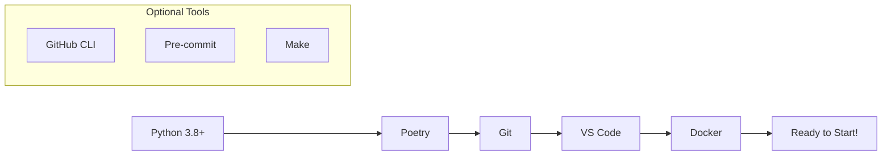
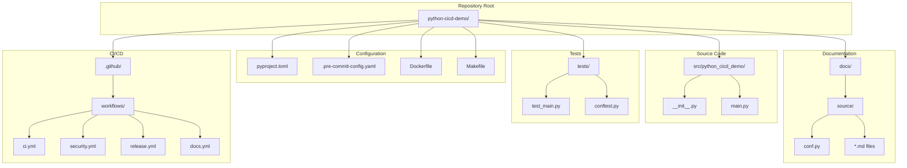
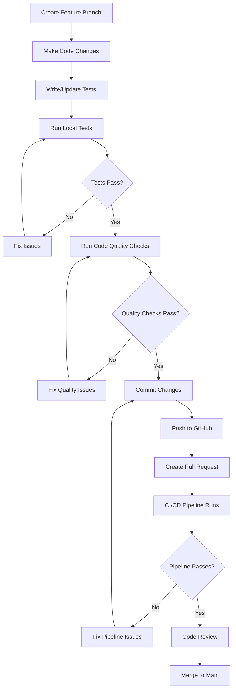

# Getting Started Guide

## Prerequisites

Before you begin working with this Python CI/CD Demo project, ensure you have the following tools installed on your system:

### Required Software



#### Core Requirements

- **Python 3.8 or higher**: The project supports Python 3.8 through 3.12
- **Poetry**: Dependency management and virtual environment handling
- **Git**: Version control (obviously!)
- **VS Code**: Recommended IDE with excellent Python support

#### Optional Tools

- **GitHub CLI**: For easier repository management
- **Docker**: If you want to run the containerized version
- **Make**: For using the provided Makefile shortcuts

### System Setup

#### 1. Install Python

**Windows (via Python.org):**
```powershell
# Download from https://python.org/downloads/
# Ensure "Add to PATH" is checked during installation
python --version
```

**macOS (via Homebrew):**
```bash
brew install python@3.12
python3 --version
```

**Linux (Ubuntu/Debian):**
```bash
sudo apt update
sudo apt install python3.12 python3.12-venv python3-pip
python3 --version
```

#### 2. Install Poetry

```bash
# Install Poetry (cross-platform)
curl -sSL https://install.python-poetry.org | python3 -

# Or via pip
pip install poetry

# Verify installation
poetry --version
```

#### 3. Install Git

Follow the installation guide at [git-scm.com](https://git-scm.com/downloads)

## Quick Start

### 1. Clone the Repository

```bash
# Clone the repository
git clone https://github.com/yourusername/python-cicd-demo.git
cd python-cicd-demo

# Or fork it first, then clone your fork
gh repo fork yourusername/python-cicd-demo --clone
```

### 2. Set Up the Development Environment

```bash
# Install dependencies with Poetry
poetry install

# Activate the virtual environment
poetry shell

# Verify the installation
poetry run pytest --version
poetry run python -c "import python_cicd_demo; print('Setup successful!')"
```

### 3. Run Initial Tests

```bash
# Run the test suite
poetry run pytest

# Run with coverage report
poetry run pytest --cov=src/python_cicd_demo --cov-report=term-missing

# Run security scan
poetry run bandit -r src/
```

### 4. Set Up Pre-commit Hooks (Recommended)

```bash
# Install pre-commit hooks
poetry run pre-commit install

# Test the hooks
poetry run pre-commit run --all-files
```

## Development Workflow

### Project Structure Overview



### Daily Development Commands

Here are the most common commands you'll use during development:

#### Testing Commands
```bash
# Run all tests
make test

# Run tests with coverage
make test-coverage

# Run specific test file
poetry run pytest tests/test_main.py

# Run tests in watch mode (requires pytest-watch)
poetry run ptw
```

#### Code Quality Commands
```bash
# Format code
make format

# Check code style
make lint

# Sort imports
make sort-imports

# Run security scan
make security-scan

# Run all quality checks
make quality
```

#### Documentation Commands
```bash
# Build documentation
make docs

# Build and serve documentation locally
make docs-serve

# Clean documentation build
make docs-clean
```

### VS Code Integration

The project includes VS Code configuration for optimal development experience:

#### Recommended Extensions

1. **Python** - Official Python extension by Microsoft
2. **Pylance** - Fast, feature-rich language support
3. **Python Test Explorer** - Visual test runner
4. **GitLens** - Enhanced Git capabilities
5. **Better Comments** - Improved comment highlighting
6. **autoDocstring** - Automatic docstring generation

#### VS Code Tasks

The project includes pre-configured tasks accessible via `Ctrl+Shift+P` → "Tasks: Run Task":

- **Install Dependencies**: `poetry install`
- **Run Tests**: `poetry run pytest` with coverage
- **Format Code**: `poetry run black src tests`
- **Sort Imports**: `poetry run isort src tests`
- **Security Scan**: `poetry run bandit -r src/`
- **Build Documentation**: `poetry run sphinx-build`

#### Debugging Configuration

Launch configurations are provided for:
- **Debug Current File**: Debug the currently open Python file
- **Debug Tests**: Debug the test suite
- **Debug Main Module**: Debug the main application

## Environment Configuration

### Environment Variables

Create a `.env` file in the project root for local development:

```bash
# .env file (create this locally - it's in .gitignore)
DEBUG=true
LOG_LEVEL=DEBUG
ENVIRONMENT=development

# Optional: API keys for external services
CODECOV_TOKEN=your_codecov_token_here
```

### Poetry Configuration

Customize Poetry behavior with these commands:

```bash
# Configure Poetry to create virtual environments in project directory
poetry config virtualenvs.in-project true

# Set specific Python version
poetry env use python3.12

# Show current configuration
poetry config --list
```

## Working with the Code

### Making Your First Change

Let's walk through making a simple change to understand the workflow:



#### Step-by-Step Example

1. **Create a new branch:**
   ```bash
   git checkout -b feature/add-multiply-function
   ```

2. **Add a new function to `src/python_cicd_demo/main.py`:**
   ```python
   def multiply(a: float, b: float) -> float:
       """Multiply two numbers.

       Args:
           a: First number
           b: Second number

       Returns:
           The product of a and b
       """
       return a * b
   ```

3. **Add tests in `tests/test_main.py`:**
   ```python
   def test_multiply():
       """Test multiply function."""
       assert multiply(2, 3) == 6
       assert multiply(-1, 5) == -5
       assert multiply(0, 10) == 0
   ```

4. **Run tests locally:**
   ```bash
   poetry run pytest tests/test_main.py::test_multiply -v
   ```

5. **Check code quality:**
   ```bash
   poetry run black src tests
   poetry run isort src tests
   poetry run bandit -r src/
   ```

6. **Commit and push:**
   ```bash
   git add .
   git commit -m "feat: add multiply function with tests"
   git push origin feature/add-multiply-function
   ```

7. **Create a pull request** through GitHub's web interface

### Understanding Test Results

Our test suite provides comprehensive feedback:

#### Coverage Reports
```bash
# Generate HTML coverage report
poetry run pytest --cov=src/python_cicd_demo --cov-report=html

# View the report
open htmlcov/index.html  # macOS
start htmlcov/index.html  # Windows
```

#### Test Categories

- **Unit Tests**: Test individual functions in isolation
- **Integration Tests**: Test component interactions
- **Property-based Tests**: Test with generated inputs (using Hypothesis)
- **Performance Tests**: Benchmark critical functions

## Troubleshooting

### Common Issues and Solutions

#### Poetry Issues

**Problem**: `poetry install` fails with dependency conflicts
```bash
# Solution: Clear cache and reinstall
poetry cache clear --all pypi
rm poetry.lock
poetry install
```

**Problem**: Virtual environment not found
```bash
# Solution: Recreate the environment
poetry env remove python
poetry install
```

#### Test Issues

**Problem**: Tests fail with import errors
```bash
# Solution: Ensure proper PYTHONPATH
poetry run python -m pytest
# Or install in development mode
poetry install
```

**Problem**: Coverage reports missing files
```bash
# Solution: Check source paths in pyproject.toml
[tool.coverage.run]
source = ["src"]
```

#### Git Issues

**Problem**: Pre-commit hooks failing
```bash
# Solution: Update hooks and run manually
poetry run pre-commit autoupdate
poetry run pre-commit run --all-files
```

**Problem**: Large files committed accidentally
```bash
# Solution: Use git filter-branch or BFG
git filter-branch --force --index-filter \
  'git rm --cached --ignore-unmatch path/to/large/file' \
  --prune-empty --tag-name-filter cat -- --all
```

### Getting Help

#### Documentation Resources

- **Official Docs**: This documentation you're reading
- **API Reference**: Auto-generated from docstrings
- **GitHub Discussions**: Community Q&A
- **Issue Tracker**: Bug reports and feature requests

#### Development Resources

- **Poetry Documentation**: [python-poetry.org](https://python-poetry.org/)
- **pytest Documentation**: [docs.pytest.org](https://docs.pytest.org/)
- **GitHub Actions**: [docs.github.com/actions](https://docs.github.com/actions)

#### Community Support

- **Discussions**: Use GitHub Discussions for questions
- **Issues**: Report bugs via GitHub Issues
- **Pull Requests**: Contribute improvements
- **Code Review**: Learn from peer review feedback

## Next Steps

Now that you have the project set up, you might want to:

1. **Explore the Codebase**: Read through the source code and tests
2. **Run the Application**: Use `poetry run python -m python_cicd_demo.main`
3. **Check the CI/CD Pipelines**: Look at the GitHub Actions workflows
4. **Read the Contributing Guide**: Learn how to contribute to the project
5. **Build the Documentation**: Generate and browse the full documentation

Happy coding! 🚀
