# Python CI/CD Demo Documentation

Welcome to the Python CI/CD Demo project documentation!

This project demonstrates modern Python development practices with comprehensive CI/CD workflows, serving as a comprehensive educational resource for developers learning modern software engineering best practices.

## Quick Navigation

```mermaid
graph TB
    A[📖 Getting Started] --> B[🔧 Development Guide]
    B --> C[🚀 CI/CD Pipeline]
    C --> D[🤝 Contributing]

    A --> E[📊 Project Overview]
    E --> F[📚 API Reference]

    subgraph "Key Features"
        G[✅ Automated Testing]
        H[🛡️ Security Scanning]
        I[📦 Dependency Management]
        J[📋 Code Quality]
    end
```



## Contents

```{toctree}
:maxdepth: 2
:caption: User Guide:

overview
getting-started
development
cicd-pipeline
contributing
```

```{toctree}
:maxdepth: 2
:caption: Technical Reference:

api
```

## Project Highlights

### 🎯 Educational Focus
This project serves as a hands-on learning resource that demonstrates:
- **Modern Python Development**: Best practices for structuring and developing Python applications
- **Comprehensive Testing**: Unit, integration, and security testing strategies
- **CI/CD Automation**: GitHub Actions workflows for continuous integration and deployment
- **Code Quality**: Automated formatting, linting, and security scanning
- **Documentation**: Comprehensive documentation with Sphinx and MyST

### 🛠️ Technology Stack
- **Python 3.8+**: Modern Python with type hints and async support
- **Poetry**: Dependency management and virtual environment handling
- **pytest**: Comprehensive testing framework with coverage analysis
- **GitHub Actions**: CI/CD automation with multi-platform testing
- **Sphinx**: Documentation generation with MyST markdown support
- **Docker**: Containerization with security best practices

### 📊 Quality Metrics
- **Test Coverage**: 80%+ line coverage requirement
- **Security**: Zero high-severity vulnerabilities
- **Code Style**: 100% Black compliant formatting
- **Documentation**: All public APIs documented

## Quick Start

```bash
# Clone the repository
git clone https://github.com/yourusername/python-cicd-demo.git
cd python-cicd-demo

# Install dependencies
poetry install

# Run tests
poetry run pytest

# Check code quality
poetry run black src tests
poetry run bandit -r src/
```

## Indices and tables

* {ref}`genindex`
* {ref}`modindex`
* {ref}`search`
