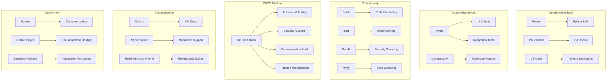
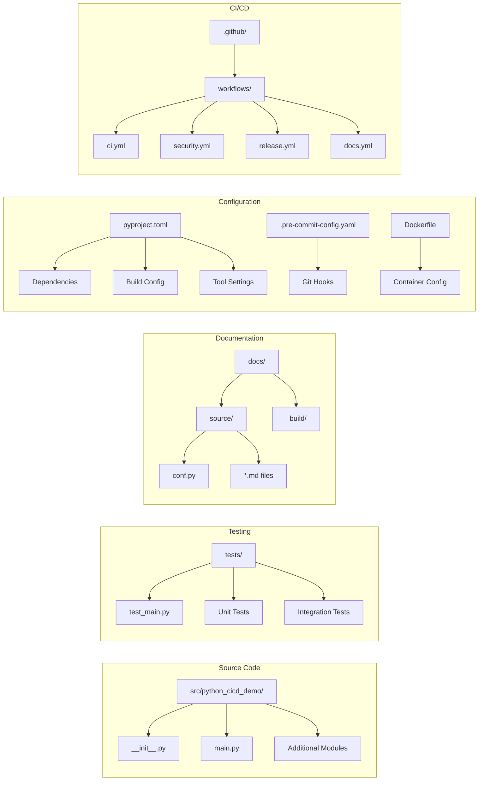

# Project Overview

## Vision and Goals

The Python CI/CD Demo project serves as a comprehensive educational resource that demonstrates modern software engineering best practices. Our goal is to provide developers with a real-world example of how to structure, test, secure, and deploy Python applications using industry-standard tools and methodologies.

## Core Principles

### 🔄 Automation First

Every aspect of the development lifecycle should be automated where possible:

- Code formatting and linting
- Testing and coverage reporting
- Security scanning and vulnerability detection
- Documentation generation and deployment
- Release management and versioning

### 🛡️ Security by Design

Security is integrated throughout the development process:

- Static code analysis with CodeQL
- Dependency vulnerability scanning
- Secret scanning and leak prevention
- Container security hardening
- Secure authentication with OIDC

### 📊 Quality Enforcement

Maintain high code quality through:

- Comprehensive test coverage (unit, integration, end-to-end)
- Code style consistency with Black and isort
- Type checking and static analysis
- Pre-commit hooks for early feedback
- Continuous integration validation

### 📚 Documentation Excellence

Every component should be well-documented:

- API documentation generated from docstrings
- Architecture decision records (ADRs)
- User guides and tutorials
- Runbooks for operations
- Contribution guidelines

## Technology Stack

## Architecture Overview

The project follows a modern Python package structure with clear separation of concerns:

## Project Metrics

### Code Quality Metrics

- **Test Coverage**: Target 80%+ line coverage
- **Code Style**: 100% Black compliant
- **Security**: Zero high-severity vulnerabilities
- **Documentation**: All public APIs documented

### Performance Targets

- **CI Pipeline**: Complete in under 10 minutes
- **Test Suite**: Execute in under 2 minutes
- **Build Time**: Docker image build under 5 minutes
- **Documentation**: Generate in under 3 minutes

### Reliability Goals

- **CI Success Rate**: >95% on main branch
- **Deployment Success**: >99% for releases
- **Zero Downtime**: For documentation deployments
- **Security Response**: Patch critical issues within 24 hours
